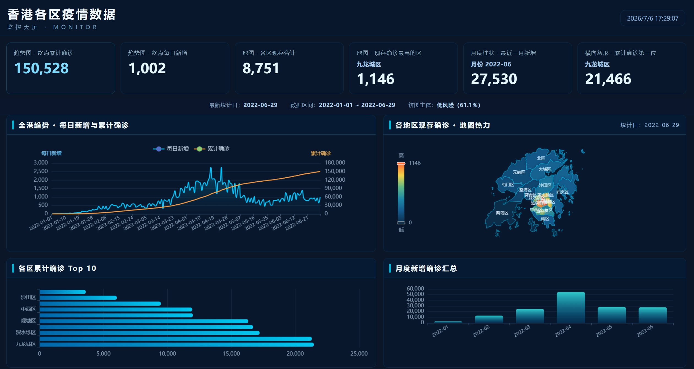
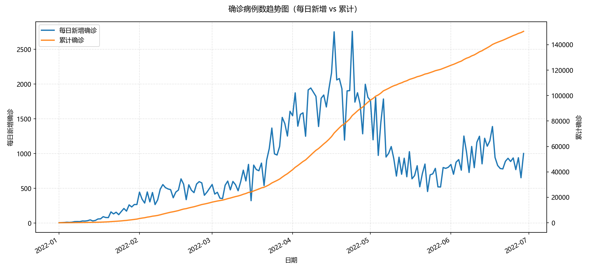

# 香港疫情实时监控大屏

基于 Flask 和 ECharts 的香港疫情可视化监控大屏，用于展示疫情趋势、地区分布和核心统计指标。

## 功能特点

- **核心指标展示**：累计确诊、最新日新增、各区现存合计、重点地区排名、月度新增等
- **趋势数据可视化**：每日新增与累计确诊趋势、各区累计确诊 Top 10、各区最新日新增
- **地理分布图**：香港各区域现存确诊热力分布
- **风险分布展示**：最新统计日风险等级分布



## 项目结构

```text
├── app.py                          # Flask 应用主文件
├── data_loader.py                  # 数据读取与聚合逻辑
├── generate_confirmed_trends.py    # 趋势图生成脚本
├── static                          # 静态文件目录
│   ├── css
│   │   └── dashboard.css           # 大屏样式
│   ├── js
│   │   └── dashboard.js            # 图表渲染逻辑
│   ├── geo
│   │   └── hk_districts_full.json  # 香港 18 区边界地理信息json
│   └── images
│       ├── confirmed_trends.png	# 确认病例数趋势图
│       └── Epidemic.jpg
├── templates
│   └── dashboard.html          	# 主页面模板
├── 香港各区疫情数据_20250322.xlsx     # 疫情数据文件
└── requirements.txt            	# 依赖项列表
```

## 运行指南

### 1. 安装依赖

```bash
pip install -r requirements.txt
```

### 2. 启动应用

```bash
python app.py
```

启动后，在浏览器中访问  http://127.0.0.1:5000/ 即可查看疫情监控大屏。

## 生成趋势图

如果需要单独生成全港确诊趋势图，可以执行：

```bash
python generate_confirmed_trends.py
```

生成结果会保存到 `static/images/confirmed_trends.png`。



## 数据更新

系统默认读取 `香港各区疫情数据_20250322.xlsx` 作为数据源。如需更新数据，请按照相同格式替换该文件。

## 技术栈

- **后端**：Flask (Python)
- **数据处理**：Pandas
- **前端可视化**：ECharts 5.5.0
- **样式**：自定义 CSS

## 浏览器兼容性

推荐使用 Chrome、Firefox、Edge 等现代浏览器访问。
